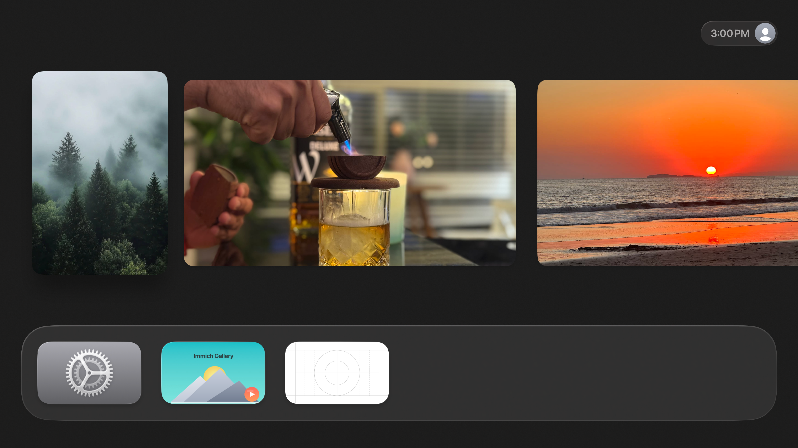
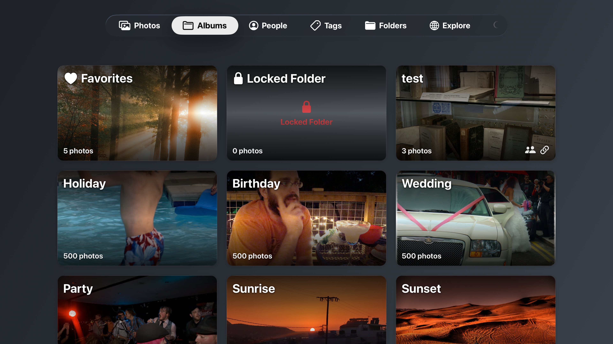
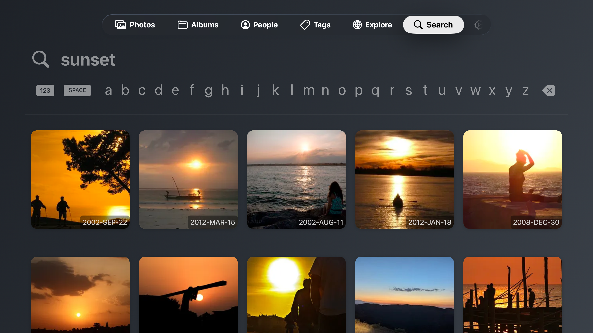
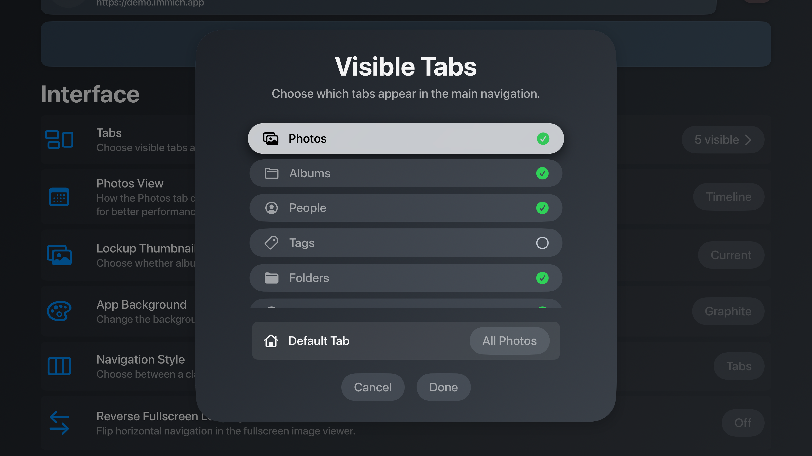

  

# Immich Gallery for Apple TV

A native Apple TV app for browsing your self-hosted Immich photo library with a TV-optimized interface.

## Features

- 🖼️ **Photo Grid View**: Browse your library in a fast, infinite-scrolling grid
- 👥 **People Recognition**: Jump straight to people Immich detects in your photos
- 📁 **Album Support**: Navigate personal and shared Immich albums
- 🏷️ **Tag Support with animated thumbnails**: Optional tag tab with looping previews
- 🗂️ **Folders Tab** : View external libray folders.
- 🔍 **Explore Tab**: Discover stats, locations, and highlights from your library
- 📺 **Top Shelf Customization**: Pick featured or random photos for the Apple TV top shelf
- 🎬 **Slideshow Mode**: Full-screen slideshow with optional clock overlay
- 👤 **Multi-User Support**: Store multiple accounts and switch instantly
- 📊 **EXIF Data**: Inspect camera details and location metadata
- 🔒 **Privacy First**: Pure client, keeps credentials local

  

## Requirements

- Apple TV (4th generation or later)
- tvOS 15.0+
- Immich server running and accessible
- Network connectivity between Apple TV and Immich server

## Quick Start

1. **Launch the app** - You'll be prompted to sign in to your Immich server
2. **Enter credentials** - Provide the server URL (e.g., `https://your-immich-server.com`) plus either email & password or an Immich API key
3. **Browse your photos** - Navigate using the Apple TV remote or Siri Remote

> [!NOTE]
>
> - Stuck on "Data couldn't read because its missing"? Update Immich and retry: https://github.com/mensadilabs/Immich-Gallery/issues/67
> - OAuth / OIDC sign-in needs server-side changes (tracked in https://github.com/mensadilabs/Immich-Gallery/issues/77). Use an Immich API key instead.
> - FaceID / PIN locking is currently out of scope. https://github.com/mensadilabs/Immich-Gallery/issues/64

### Building from Source

1. Clone the repository
2. Open `Immich Gallery.xcodeproj` in Xcode
3. Select Apple TV target device
4. Build and run

## Screenshots

## Stats

